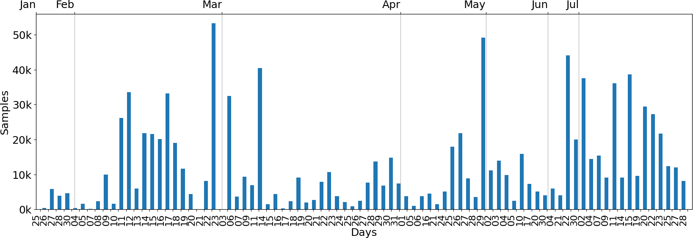
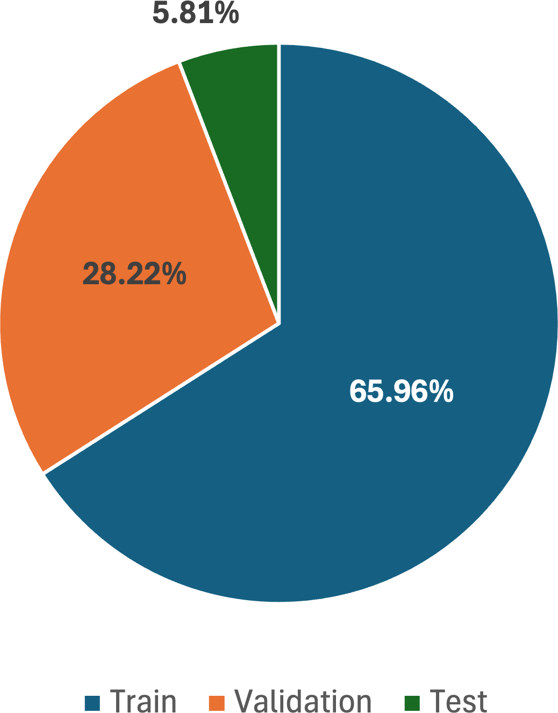

# Road-Surface-Dataset-alternative-usage
This repository contains an alternative re-organization of the [RSCD dataset](https://thu-rsxd.com/rscd/), a recent large dataset posing the challenging problem of recognizing the road surface conditions by addressing three different classification tasks.

We reorganized the dataset on a per-acquisition-day basis using the naming information provided by the authors. The number of samples for each day is reported below:

We split the data so that samples acquired on the same day are in the same subset, i.e., one among training, validation, and test. This yields a slightly different partition of the samples among the three subsets, which is depicted below:

This reorganization allows one to assess the generalization capabilities of the methods. To this aim, we provide the three separate CSV files, each containing the paths to the samples in the original dataset folder.
